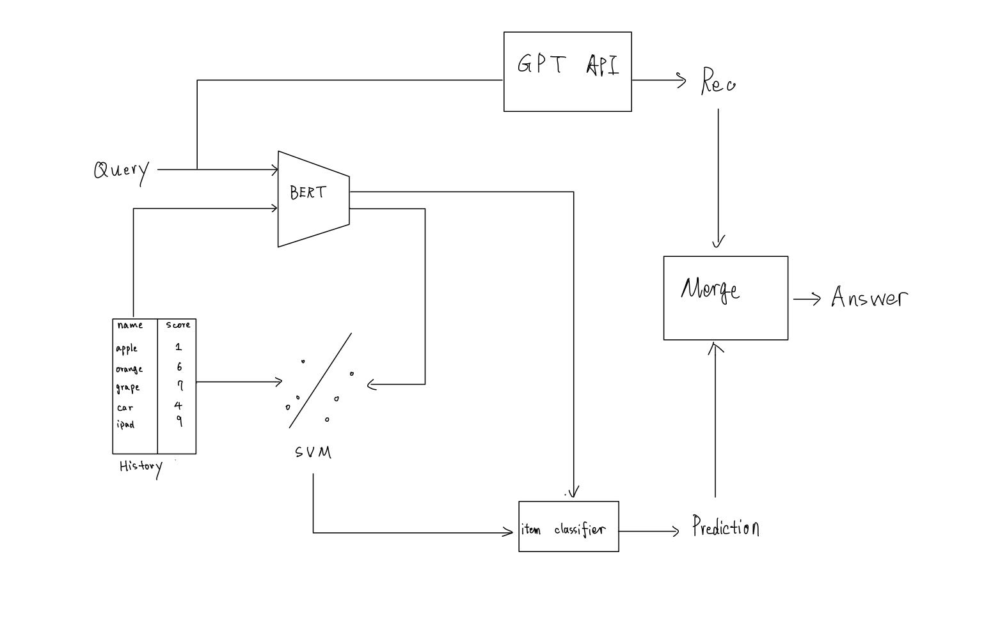
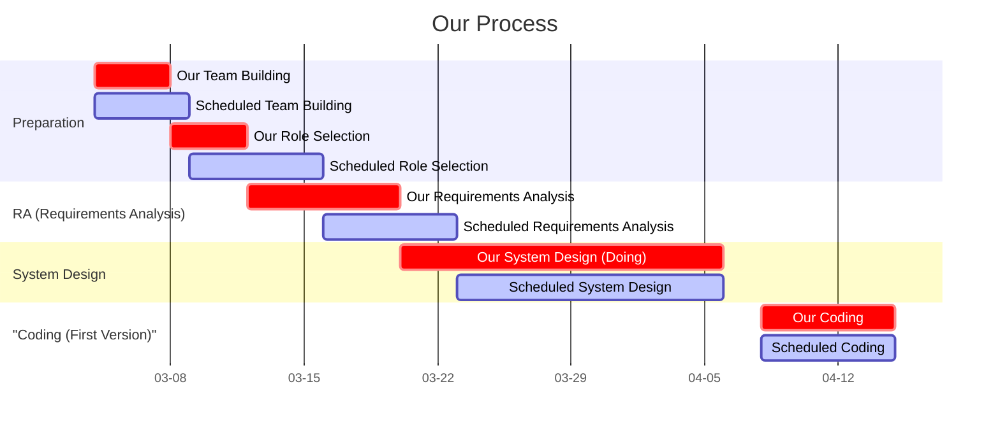
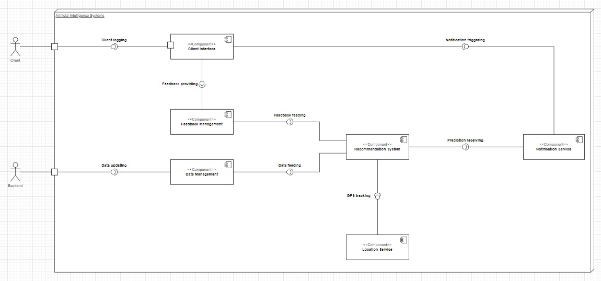

# DSD Team: Better Call Li!

## 📒Directory

- We update all our milestones and progress on [README.md](./README.md) 
- We store all userfull materials in [materials](./materials) 

## 🌟Recommendation System Overview 
- Interface handbook is at [handbook](./materials/interface%20specification%20v.5.1.md)    
- The pipeline of Recommendation system 
    

## 🚩Progress

- We keep track of every small milestone we achieve. This branch should be updated with a minimum frequency of once in two days. 

- 4.13 update of [codebase](./codebase/), now it can recommend items, recommend stores, improve via user feedback 

    - recommend items and stores via BERT-based embedding calculation

    - able to save history data locally (.json format) 

    - able to improve via user feedback s

- 4.10 Release First draft of code at [codebase](./codebase/): Recommend with embedding similarity and GPT Assistance 

- 4.9 make some change to our interface to adjust the need of other group.

- 4.8 started coding the first iteration coding. and already made some progress.

- 3.31 finished the task of system architecture. 

- 3.26 a meeting was arranged for all the group leaders and we were offered a template for SA. Our system architect has begun working on that.

#### Gantt Chart
 - here is a gantt chart for our group. red stripes represent our current process and the blue stripes represent the ordered process .

#### System Architecture
 - 2024.3.26: our system architect finished first version of component diagram which has been shown below. the work will be updated in the future.
 - 

 - 2024.3.31：made some changes to our component diagram, and finished out class diagram. all the docmuments are available in the folder SA.

#### Requirement Analysis

- 2024.3.15: Finished our final version of requirement analysis

- [Our requirement analysis](./req-analysis/req_doc.md) 

## 💡 Team Roles

|        |      PM      |   Liasion    |     R-A      |     S-A      |  Programmer  |    Tester    |
| :----: | :----------: | :----------: | :----------: | :----------: | :----------: | :----------: |
|  Mike  | $\checkmark$ | $\checkmark$ |              |              |              |              |
|   Li   |              |              |              |              | $\checkmark$ |              |
|  Joey  |              |              |              |              |              | $\checkmark$ |
|  Fish  |              |              |              |              | $\checkmark$ |              |
| Matias |              |              |              | $\checkmark$ |              |              |
| David  |              |              | $\checkmark$ |              |              |              |

## 🌐Team Members

#### PM: Peisen Zheng
- nickname: Mike

- working in the field of AIGC

#### Programmer: Guanghe Li 

- nickname: Li
- Adv: Coding, AI(Reinforcement Learning), English
- ACM gold medal winner

#### Tester: Zhouyuan Ma
- nickname: Joey

- working in the field of multimode large model now

#### Another Programmer: Changsheng Huang
- nickname:Fish(weird name huh,nerifish actually, but everybody in the english class call him fish,so let's just say fish)

- also ACM gold medal winner

#### System Architect: João Matias
- nickname: Matias

- the portuguese one (insert Jose Mourinho reference)

#### Requirement analyst: David Ramos Dias
- nickname: David

- responsible for RA part
