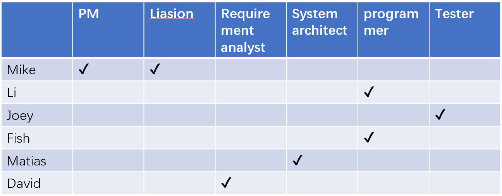
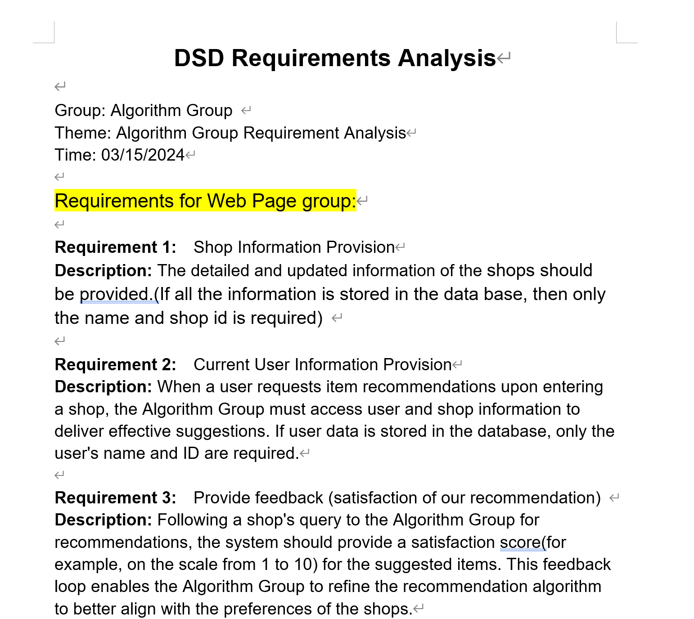
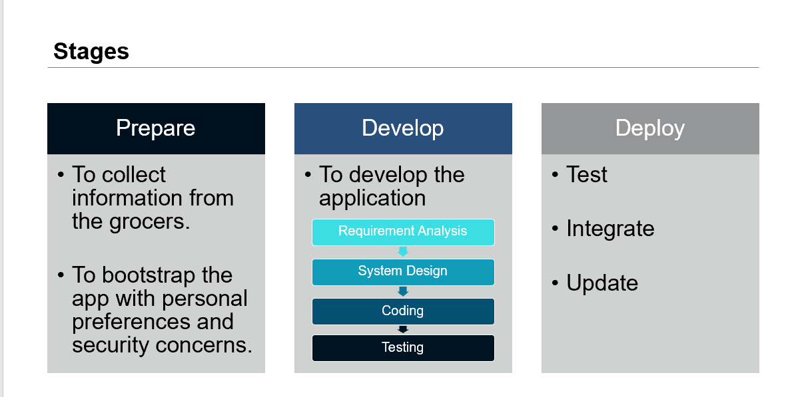
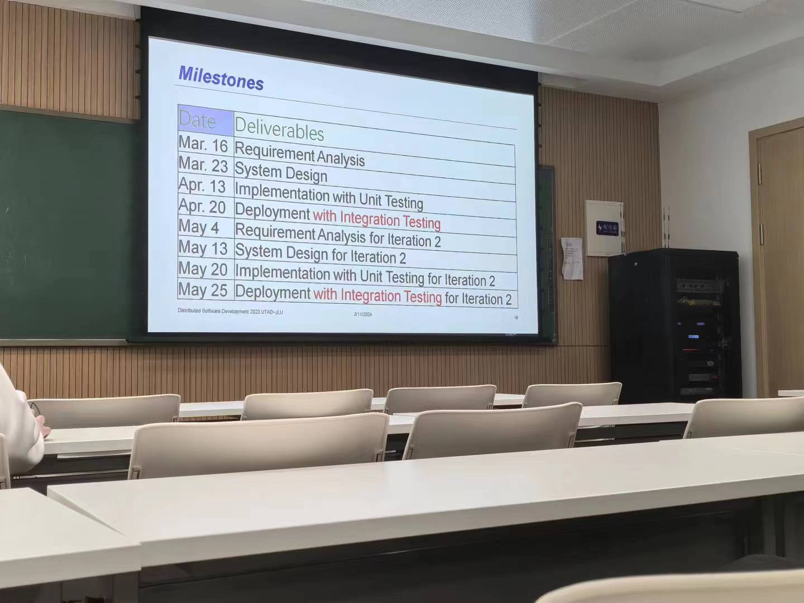

# Already done all the recruiting things
team name:better call Li

## current work
2024.3.9: completed building up the team. And set roles for every members as below

2024.3.11: our requirements analyst has started working on his work. and the deadline will be this saturday which is 2024.3.16
2024.3.15：finished requirement analysis.
 

## PM: Peisen Zheng
- nickname: Mike

- working in the field of AIGC

## Programmer: Guanghe Li 

- damn right, this is Li, and he is goddamned gifted, you can count on him

- nickname: Li

- Adv: Coding, AI(Reinforcement Learning), English

- ACM gold medal winner

- also a super fan of Cristiano Ronaldo

## Tester: Zhouyuan Ma
- nickname: Joey

- working in the field of multimode large model now

## Another Programmer: Changsheng Huang
- nickname:Fish(weird name huh,nerifish actually, but everybody in the english class call him fish,so let's just say fish)

- also ACM gold medal winner

## System Architect: João Matias
- nickname: Matias

- the portuguese one (insert Jose Mourinho reference)

## Requirement analyst: David Ramos Dias
- nickname: David

-responsible for RA part

# About the project
briefly speaking, the project is about developing an app that can go buzzing or vibrating or whatever as long as it can remind user that there are something worthy to pay a visit around. It can be a reputable restaurant or bar or some scenery spots etc. And our group members has already taken the programming task and testing task.

